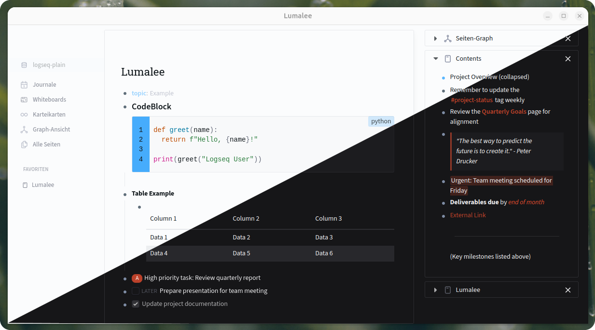

# Lumalee Logseq Theme

Lumalee is a clean, minimalistic theme for Logseq with light and dark modes. It is based on [gavinmn](https://github.com/gavinmn)'s Luma theme but adds improved styling and support for custom accent colors.



## Manual installation

Add the following to your Logseq custom.css file:
```
@import url('https://cdn.jsdelivr.net/gh/kay-ki/logseq-lumalee/custom.min.css');
```
